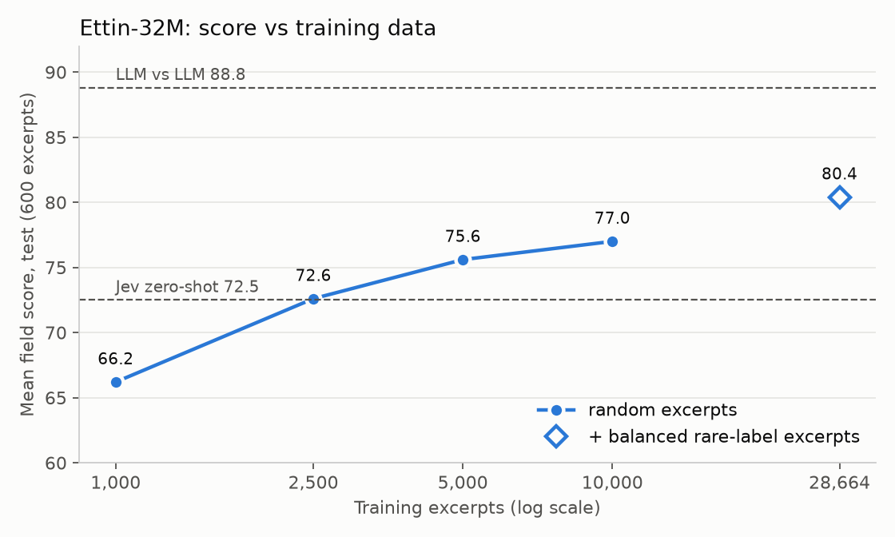

# 02 Fine-tuning small encoders and decision models

**Status:** done (2026-10-08).

## Question

What is the smallest model, by compute per excerpt, that reaches 01's LLM range on excerpt tagging after fine-tuning, with the context the production pipeline uses, and how many labelled examples does it take?

Why: the case for a small model is compute and environmental impact. A ~150M encoder needs a small fraction of a 10B+-active-parameter LLM's compute per excerpt, if it can match its tags.

## Conclusion

- **Fine-tuned small encoders tag excerpts at 79.7–81.4** against the LLMs' 88.8, on 600 test excerpts.
  - For comparison: the production pipeline's own labels score 67.5, and the best zero-shot decision model (Jev, [01](../01-many-option-classification/README.md#zero-shot-decision-models)) 72.5.
  - The best model is Granite-embedding-97M-r2 at 81.4.
  - Ettin-32M scores 80.4 with 31M parameters, at about 3.4 × 10¹⁰ FLOPs per excerpt (2 × parameters × 541 tokens).
- **The choice of encoder matters little.** The top 10 of 12 are within 1.7 points.
- **The training data matters more:**
  - Ettin-32M goes from 66.2 at 1,000 random excerpts to 77.0 at 10,000.
  - Adding 18,666 excerpts selected for rare labels takes it to 80.4.
  - On the four methods with enough test positives, that raises the macro-F1 from 58.8 to 77.8.
- **Averages hide weak labels, and the weak labels are where the references disagree.**
  - The weakest themes are science and technology (model F1 16–29), global partnerships (45–49) and civil society (63–67). The two LLMs agree with each other on these at 6, 36 and 65.
  - On themes, the best models' macro-F1 (75–78) equals the LLMs' agreement with each other (77.5).
  - The remaining gap is mostly label ambiguity in the taxonomy, not model capacity.
- **The test set can't measure most labels.** In 900 validation and test excerpts, only 18 of 22 themes, 7 of 17 regions and 4 of 24 methods have at least 5 positives.
- **Decision models:**
  - The one decision-model backbone fine-tuned here (ModernJEV-Decide-Preview) scores 79.7, no better than general encoders.
  - Zero-shot decision models score 38–72 ([01](../01-many-option-classification/README.md#zero-shot-decision-models)).
  - For a fixed, high-volume task with LLM-labelled training data, a fine-tuned small general encoder is the better choice. Without training data, zero-shot decision models remain the option (not tested beyond this task).
- **Inheriting the document's tags is not enough.** Excerpts given their document's tags score 64–66 on themes and 52–61 on countries (test).
- **What this means for production:** production extracts excerpts and tags them in the same LLM call. Replacing the tagging alone removes part of each prompt but not the call. The follow-on work, extracting excerpts with small models, continues in EvalExplorer's own repository.
- **Limits:**
  - Scores measure agreement with two LLMs, not correctness. There is no human gold set.
  - The country lookup also matches donor countries named in report titles (the UK in 79 of 675 validation + test excerpts; the LLMs agree in 7). Keeping such countries only when the excerpt names them raises countries from 72.3 to 78.4 on test. The numbers here use the lookup as published.

## Method

1. Input: `doc+summary`, the context chosen by 01's [context pilot](../01-many-option-classification/README.md#pilot-result) (title, Document Start, executive summary and abstract, then the excerpt), so the model sees what production's tagger sees. Document-level context (title, Document Start, summary) is the same for every excerpt of a report, so a model can encode it once per document.
2. Label a fixed sample of 10,000 train excerpts (5,000 findings, 2,500 recommendations, 2,500 methodology, seed 0; ids in [results/labels/train_sample.json](results/labels/train_sample.json)) with GLM-5.3-Flash and DeepSeek-V4.1-Flash, using production's taxonomy and definitions.
   - Training targets are soft: 1 if both LLMs chose the label, 0.5 if one did, 0 if neither.
   - Evaluation: 01's test excerpts, scored as mean agreement with GLM and DeepSeek.
3. Fine-tune small encoders on those labels as HF Jobs in the `baobabtech` namespace with [train_encoder.py](train_encoder.py), which reads everything from the Hub so others can rerun it. Candidates: encoders released since March 2026 under ~300M parameters with a context window of at least 8,192 tokens, with ModernBERT-base and Ettin as 2025 references; label-conditioned models (GLiClass, GLiNER2.5) in a second round.
   - **Input layout:** `[start] excerpt block [sep] context block [sep]`, excerpt first, so truncation only cuts context. The excerpt and context blocks keep their headings (`## EXCERPT TO CLASSIFY`, `## CONTEXT SECTIONS`) as markers.
   - **Joint model (default):** one pass over excerpt + context; the classifier reads the mean of the excerpt's token vectors only. Those tokens attend to the context, so they carry the report's country and topic, but the context tokens do not dilute the vector the classifier reads. ~540 tokens per excerpt.
   - **Two-tower model:** the same encoder reads the document context once per report and the excerpt on its own; the classifier sees [excerpt vector, context vector, their product]. At ~135 excerpts per report, that is ~90 tokens per excerpt, about 6× less compute. Run with `jhu-clsp/ettin-encoder-150m`.
4. Score on 01's test excerpts; fit one threshold on 01's validation sample; report compute per excerpt next to the score.
5. One run on pipeline labels for the same excerpts shows how much the label source matters.

Second step: every encoder with its own training recipe, on the random sample plus a balanced sample for rare labels, with countries from the lookup; a learning curve; per-label scoring.

## Results

### First step: encoder sweep

Run 2026-10-06 as HF Jobs in `baobabtech` (A10G; bf16; effective batch 32; 5 epochs; learning rate 5e-5; one threshold fitted on 01's validation sample). Training: 9,998 excerpts with soft GLM + DeepSeek labels and the `doc+summary` context (dataset revision `5b5de6f`). Test: 01's 600 excerpts. Score: mean micro-F1 × 100 against GLM and DeepSeek; the LLMs agree with each other at **88.8** (themes 82.4, regions 94.9, countries 89.8, methods 88.1). Per-run metrics: [results/sweep_summary.json](results/sweep_summary.json) and each model repo (`baobabtech/evaldocs-excerpt-tagger-*`, private).

| Model | Params | Mean | Themes | Regions | Countries | Methods | Tokens per excerpt |
|---|---:|---:|---:|---:|---:|---:|---:|
| Ettin-150M, countries from lookup | 149M | **75.3** | **80.6** | 83.7 | 72.3 | 64.4 | 541 |
| Ettin-32M, countries from lookup | 32M | 74.7 | 75.5 | 82.7 | 72.3 | **68.2** | 541 |
| ModernJEV-Decide-Preview | 149M | 73.8 | 74.0 | 89.6 | 71.6 | 60.1 | 541 |
| LFM2.5-Encoder-230M | 230M | 73.5 | 68.5 | 83.5 | **78.4** | 63.7 | 548 |
| mmBERT-small | 141M | 73.4 | 69.8 | **89.7** | 71.5 | 62.7 | 521 |
| Ettin-150M | 149M | 70.9 | 70.3 | 86.4 | 73.2 | 53.7 | 541 |
| ModernBERT-base | 149M | 68.8 | 71.3 | 84.4 | 62.1 | 57.5 | 541 |
| Ettin-150M, two-tower | 150M | 64.6 | 70.3 | 75.9 | 53.7 | 58.4 | **90** |
| F2LLM-v2-80M | 80M | 63.9 | 61.2 | 86.0 | 60.5 | 47.8 | 531 |
| Ettin-32M | 32M | 63.2 | 61.8 | 81.0 | 51.6 | 58.5 | 541 |
| Country lookup alone (01) | — | — | — | 74.7 | 71.6 | — | ~0 |

- **Countries from the lookup, not the model, help every other field.** Without the 198 country outputs, Ettin-150M's themes rise from 70.3 to 80.6 and Ettin-32M's from 61.8 to 75.5. The lookup matches the best fine-tuned country scores (72.3; only LFM2.5 is higher at 78.4).
- **Size matters little in that setup:** Ettin-32M scores 74.7 against Ettin-150M's 75.3 with a fifth of the parameters.
- **Themes and regions approach the LLMs** (best 80.6 vs 82.4, and 89.7 vs 94.9). **Methods are furthest** (best 68.2 vs 88.1); the training sample has ~2,500 methodology excerpts for 24 methods.
- **The two-tower model** reads document context once per report: ~90 tokens per excerpt instead of ~540, for 6.3 points less than the joint Ettin-150M.

### Second step: per-model recipes and balanced data

Run 2026-10-06 as HF Jobs in `baobabtech` (A10G).
- **Settings:** fp32 weights with bf16 compute, up to 8 epochs keeping the best validation epoch, one threshold fitted on validation. Countries come from the lookup; the encoder tags themes, regions and methods.
- **Training data:** 28,664 excerpts (random 9,998 + balanced 18,666; dataset revision `e191ae3`).
- **Scoring:** micro-F1 on the 600 test excerpts, as in the first step. Macro-F1 is the mean F1 over labels with at least 5 reference positives in validation + test (900 excerpts), with a 95% bootstrap interval ([common/per_label.py](../common/per_label.py)). Methods macro covers only 4 labels.
- **LLM vs LLM:** micro 88.8 (themes 82.4, regions 94.9, methods 88.1); macro themes 77.5, regions 93.6, methods 77.7.
- **Files:** per-run metrics in [results/sweep2_summary.json](results/sweep2_summary.json); per-label scores in [results/per_label/](results/per_label/). Every test score was reproduced to within 0.1 by re-predicting from the saved model ([predict_saved.py](predict_saved.py), [score_per_label.py](score_per_label.py)).

| Model | Params | Tokens per excerpt | Mean (micro) | Themes | Regions | Methods | Macro themes | Macro methods |
|---|---:|---:|---:|---:|---:|---:|---:|---:|
| Granite-embedding-97M-r2 | 97M | 514 | **81.4** | 82.5 | 84.7 | **86.2** | 76.8 [74.3, 78.5] | 76.4 [64.2, 83.5] |
| harrier-oss-v1-270m | 268M | 528 | 81.2 | 83.0 | 84.6 | 85.0 | **78.2** [76.1, 79.8] | **78.8** [68.8, 85.4] |
| ModernBERT-base | 149M | 541 | 81.0 | 81.7 | 84.7 | 85.4 | 77.3 [75.1, 78.9] | 77.5 [66.5, 84.6] |
| NeoMME-260M | 263M | 534 | 80.9 | **83.3** | 84.2 | 83.8 | 76.9 [74.5, 78.8] | 73.1 [60.0, 81.3] |
| gte-modernbert-base | 149M | 541 | 80.7 | 80.8 | **85.0** | 84.6 | 75.8 [73.5, 77.5] | 75.5 [63.9, 83.2] |
| Ettin-32M | 31M | 541 | 80.4 | 79.2 | 84.3 | 85.6 | 75.2 [72.5, 77.1] | 77.8 [66.0, 85.7] |
| mmBERT-small | 140M | 521 | 80.3 | 81.2 | 84.6 | 83.0 | 75.1 [72.5, 77.1] | 70.6 [55.5, 79.6] |
| Ettin-150M | 149M | 541 | 80.1 | 81.3 | 84.7 | 82.0 | 77.4 [75.1, 79.2] | 77.6 [66.7, 84.4] |
| F2LLM-v2-80M | 80M | 531 | 79.9 | 79.7 | 84.5 | 82.9 | 75.2 [72.5, 77.3] | 76.9 [66.3, 84.0] |
| ModernJEV-Decide-Preview | 149M | 541 | 79.7 | 77.8 | 84.6 | 84.0 | 72.4 [69.8, 74.2] | 73.9 [61.8, 81.8] |
| Ettin-150M, two-tower | 149M | **90** | 79.4 | 81.4 | 84.0 | 80.1 | 77.0 [74.8, 78.6] | 72.3 [57.2, 80.9] |
| LFM2.5-Encoder-230M | 229M | 548 | 77.1 | 76.0 | 80.7 | 79.2 | 69.0 [65.6, 71.3] | 68.7 [54.0, 77.9] |

Countries (lookup) score 72.3 in every row.

- **Against the first step** (10,000 random excerpts, one shared recipe), the best mean rises from 75.3 to 81.4.
- **The two-tower model** now trails the joint Ettin-150M by 0.7 points (6.3 in the first step), for about 6× fewer tokens per excerpt.
- **Per label** (the best five models, validation + test):
  - Labels with clear definitions reach F1 85–96, close to the LLMs' agreement: education, gender, humanitarian, health, climate, sub-Saharan Africa, RCTs.
  - The low labels are those the LLMs also disagree on:

    | Label | Model F1 | LLM vs LLM |
    |---|---:|---:|
    | science and technology | 16–29 | 6 |
    | global partnerships | 45–49 | 36 |
    | civil society | 63–67 | 65 |
    | case-based methods | 54–65 | 67 |

  - Conflict is the one theme clearly below the LLMs: 64–73 against 77.

**Learning curve** (Ettin-32M; test micro mean; macro over the same labels):

| Training excerpts | Mean | Themes | Methods | Macro themes | Macro methods |
|---|---:|---:|---:|---:|---:|
| 1,000 random | 66.2 | 64.7 | 57.8 | 45.1 | 31.2 |
| 2,500 random | 72.6 | 72.3 | 64.2 | 61.8 | 33.9 |
| 5,000 random | 75.6 | 77.7 | 68.7 | 67.1 | 46.3 |
| 10,000 random | 77.0 | 77.6 | 74.6 | 71.5 | 58.8 |
| + 18,666 balanced | 80.4 | 79.2 | 85.6 | 75.2 | 77.8 |

**Document-tag inheritance baseline:** each excerpt takes its document's tags.

| Document tags used | Themes | Regions | Countries |
|---|---:|---:|---:|
| Pipeline's tags | 63.8 | 58.5 | 51.5 |
| GLM's document-level tags | 65.5 | 76.8 | 60.7 |

Test, findings and recommendations. Both rows are below the encoders (themes about 80) and the country lookup (72.3).

### Training recipes

Settings per model come from each model's card or paper (checked 2026-10-06) and live in `RECIPES` in [train_encoder.py](train_encoder.py).

- **All models:** fp32 master weights with bf16 compute. transformers 5.x otherwise loads a checkpoint in its stored dtype; models stored in bf16 or fp16 then train in that dtype, and small AdamW updates round away. AdamW with betas (0.9, 0.98), eps 1e-6, no weight decay on norms and biases, gradient clipping at 1.0, linear warmup and decay; up to 8 epochs, keeping the epoch with the best validation score (patience 2).

| Model | lr | Weight decay | Warmup | Pooling | Input | Source |
|---|---:|---:|---:|---|---|---|
| ModernBERT-base, Ettin-150M | 5e-5 | 1e-5 | 6% | mean over excerpt tokens | — | ModernBERT paper App. E; Ettin paper App. F |
| Ettin-32M | 1e-4 | 1e-5 | 6% | mean over excerpt tokens | — | Ettin paper App. F (smaller models take higher lr) |
| mmBERT-small | 3e-5 | 0.01 | 6% | mean over excerpt tokens | — | mmBERT paper App. B; card |
| gte-modernbert-base | 3e-5 | 1e-5 | 10% | CLS | — | card (CLS pooling) |
| granite-embedding-97m-multilingual-r2 | 8e-5 | 1e-5 | 6% | CLS | — | card (CLS pooling) |
| ModernJEV-Decide-Preview | 2e-5 | 1e-5 | 3% | mean over excerpt tokens | — | its training recipe |
| LFM2.5-Encoder-230M | 3e-5 | 0.1 | 10% | mean over excerpt tokens | betas (0.9, 0.95), eps 1e-5 | card; Liquid `encoder_eval` |
| NeoMME-260M | 1e-4 | 1e-5 | 6% | mean over excerpt tokens | `<doc>` token first | card; paper |
| harrier-oss-v1-270m, F2LLM-v2-80M | 4e-5 | 1e-5 | 6% | last excerpt token | instruction, context, then excerpt (one-directional decoders) | cards (last-token pooling, `Instruct:` prefix) |

### Training data

All training excerpts are real excerpts labelled by GLM-5.3-Flash and DeepSeek-V4.1-Flash with the `doc+summary` context; no synthetic text.

- **Random sample:** 10,000 excerpts (seed 0). Agreed positives per label: themes median 333 (national security 4, multilateral 4, diplomacy 5); regions median 54; methods median **19** (outcome mapping, most significant change, synthetic control: 1 each).
- **Balanced extra sample** ([select_balanced.py](select_balanced.py)): all 11,979 remaining methodology excerpts, plus up to 300 excerpts per theme and region that the pipeline tagged with it; 18,666 excerpts. Pipeline labels only choose excerpts; the LLMs label them.
- **Learning curve:** Ettin-32M trained on 1,000, 2,500, 5,000 and 10,000 random excerpts, and on random + balanced.
- **Published:** `llm_labels` config, dataset revision `e191ae3` (28,664 training excerpts: 9,998 random + 18,666 balanced; column `sample`). Agreed positives per label, random → all: themes median 333 → 760 (rarest 4 → 38); regions 54 → 257 (1 → 2); methods 19 → 173 (1 → 4). Some labels stay rare in the whole corpus (synthetic control 4, outcome harvesting 5, Micronesia 2).
- Sweep 2 job ids: [results/jobs_sweep2.tsv](results/jobs_sweep2.tsv). Sweep 2 overwrites the sweep 1 Ettin lookup repos; sweep 1 numbers are in [results/sweep_summary.json](results/sweep_summary.json).

## What we already know

- Earlier Baobab Tech runs fine-tuned generative LLMs and GLiNER2.5 on this exact task (results in `baobabtech/evalexplorer-classify-experiments`, private):

  | Model | Size | Zero-shot vs GLM | Fine-tuned vs GLM | Fine-tuned vs pipeline | Seconds per doc |
  |---|---|---:|---:|---:|---:|
  | Gemma 4 26B-A4B | 26B (4B active) | 72.9 | 80.3 | 84.4 | 1.46 |
  | Qwen3.5-4B | 4B | 66.2 | 77.8 | 84.7 | 1.22 |
  | LFM2.5-350M | 350M | 20.3 | 70.9 | 79.2 | 0.58 |
  | GLiNER2.5 small | 74M | 47.1 | 52.7 | 57.3 | 0.04 |

  Those models were fine-tuned on pipeline labels. The scores are task A only, against single label sets: GLM-5.3-Flash or the pipeline. They are rescored against 01's reference if their predictions are available.

- GLiNER2.5 base and small plateaued at 57–58 after fine-tuning (52–57 against GLM). Approach and type accuracy stayed at 25–60%.
- Jev, d1 and GLiDE cannot be fine-tuned.
- [ModernJEV-Decide-Preview](../../docs/models/modernjev-decide.md#fine-tuning) gives a cost reference: about $5.41 on one A100. It also fell below the majority baseline on a task family it was not trained on.

## Data

- **Splits:** the same as 01. Task A: documents, 1,148 train / 138 validation / 134 test. Task B: excerpts, 157,302 train, sampled per run. See [common/datasets.md](../common/datasets.md).
- **Evaluation:** 01's reference on the same test items: mean agreement with GLM-5.3-Flash and DeepSeek-V4.1-Flash. Training targets come from the same two LLMs (soft labels; see [First step](#first-step)), so zero-shot and fine-tuned scores compare directly. There is no human gold set, so scores measure agreement with LLMs, not correctness ([01](../01-many-option-classification/README.md#reference-labels)).
- **Training labels:** soft GLM + DeepSeek labels (see [Method](#method)). One run on pipeline labels for the same excerpts shows how much the label source matters.

## Not run

The original plan also fine-tuned the decision models GLiNER2.5-Decide, Laya, openJev Verdict and Kev-0.8B/4B, with per-label sample sizes, LoRA vs full fine-tuning, a forgetting check and a transfer run. The encoder results made it moot for this task: a general 31M encoder already reaches 80.4, ModernJEV-Decide fine-tunes no better than general encoders, and earlier fine-tuning of GLiNER2.5 plateaued at 57–58. The zero-shot scores of these models are in [01](../01-many-option-classification/README.md#zero-shot-decision-models).

## Data governance

- Train on this Mac where possible.
- HF Jobs run with `--namespace baobabtech`, so they bill to the org.
- Fine-tuned weights and adapters are pushed to private `baobabtech` model repos with their run metadata. Publishing them is a separate decision, made after the results are written up.
- HF Jobs does not document its region; the data is public, and the maintainer approved using it (2026-10-02).
- Label generation sends public excerpts and documents to HF Inference Providers; record the pinned provider and region.
- Record where each run trained.

## What would change a decision

- **Replace the LLM in ingestion:** a fine-tuned small model scores within 01's LLM range at a small fraction of DeepSeek-V4.1-Flash's compute per excerpt.
- **Keep the LLM:** the best fine-tuned small model stays more than ~10 points below the LLM range after 10,000 examples.
- **Keep the SFT LLMs:** decision models plateau near GLiNER2.5's 57–58.

**Outcome:** a 31M–270M encoder reaches 80–81, within 8 points of the LLM range, at about 3.4 × 10¹⁰ FLOPs per excerpt for Ettin-32M. On themes, the best models match the LLMs' per-label agreement with each other. The decision about production moved to excerpt extraction, because production tags in the same call that extracts.
